<html><head><meta content="text/html; charset=UTF-8" http-equiv="content-type"></head><body class="c72"><h1 class="c16">Task 1: Data Understanding</h1>
Explain in this task what is being carried out in general and the methods used then in every subtask put a screenshot of the code related to the title of the subtask to prove that it&#39;s done.

The data contain following columns:
<ol class="c38 lst-kix_list_1-0 start" start="1"><li class="c4 li-bullet-0">InvoiceNo</li><li class="c4 li-bullet-0">StockCode &nbsp; </li><li class="c4 li-bullet-0">Description &nbsp;</li><li class="c4 li-bullet-0">Quantity &nbsp; &nbsp; &nbsp;</li><li class="c4 li-bullet-0">InvoiceDate &nbsp; &nbsp;</li><li class="c4 li-bullet-0">UnitPrice &nbsp; &nbsp; &nbsp;</li><li class="c4 li-bullet-0">CustomerID &nbsp; &nbsp; &nbsp;</li><li class="c4 li-bullet-0">Country &nbsp;&nbsp; &nbsp; &nbsp; </li></ol>

The following table shows the raw data without any processing or modifications, with the complete information right from the source.

<table class="c55"><tbody><tr class="c25"><td class="c44" colspan="1" rowspan="1">
InvoiceNo
</td><td class="c34" colspan="1" rowspan="1">
StockCode
</td><td class="c45" colspan="1" rowspan="1">
Description
</td><td class="c66" colspan="1" rowspan="1">
Quantity
</td><td class="c35" colspan="1" rowspan="1">
InvoiceDate
</td><td class="c13" colspan="1" rowspan="1">
UnitPrice
</td><td class="c21" colspan="1" rowspan="1">
CustomerID
</td><td class="c46" colspan="1" rowspan="1">
Country
</td></tr><tr class="c65"><td class="c44" colspan="1" rowspan="1">
536365
</td><td class="c34" colspan="1" rowspan="1">
85123A
</td><td class="c45" colspan="1" rowspan="1">
WHITE HANGING HEART T-LIGHT HOLDER
</td><td class="c66" colspan="1" rowspan="1">
6
</td><td class="c35" colspan="1" rowspan="1">
2010-12-01 08:26:00
</td><td class="c13" colspan="1" rowspan="1">
2.55
</td><td class="c21" colspan="1" rowspan="1">
17850.0
</td><td class="c46" colspan="1" rowspan="1">
United Kingdom
</td></tr><tr class="c49"><td class="c44" colspan="1" rowspan="1">
536365
</td><td class="c34" colspan="1" rowspan="1">
71053
</td><td class="c45" colspan="1" rowspan="1">
WHITE METAL LANTERN
</td><td class="c66" colspan="1" rowspan="1">
6
</td><td class="c35" colspan="1" rowspan="1">
2010-12-01 08:26:00
</td><td class="c13" colspan="1" rowspan="1">
3.39
</td><td class="c21" colspan="1" rowspan="1">
17850.0
</td><td class="c46" colspan="1" rowspan="1">
United Kingdom
</td></tr><tr class="c80"><td class="c44" colspan="1" rowspan="1">
536365
</td><td class="c34" colspan="1" rowspan="1">
84406B
</td><td class="c45" colspan="1" rowspan="1">
CREAM CUPID HEARTS COAT HANGER
</td><td class="c66" colspan="1" rowspan="1">
8
</td><td class="c35" colspan="1" rowspan="1">
2010-12-01 08:26:00
</td><td class="c13" colspan="1" rowspan="1">
2.75
</td><td class="c21" colspan="1" rowspan="1">
17850.0
</td><td class="c46" colspan="1" rowspan="1">
United Kingdom
</td></tr><tr class="c65"><td class="c44" colspan="1" rowspan="1">
536365
</td><td class="c34" colspan="1" rowspan="1">
84029G
</td><td class="c45" colspan="1" rowspan="1">
KNITTED UNION FLAG HOT WATER BOTTLE
</td><td class="c66" colspan="1" rowspan="1">
6
</td><td class="c35" colspan="1" rowspan="1">
2010-12-01 08:26:00
</td><td class="c13" colspan="1" rowspan="1">
3.39
</td><td class="c21" colspan="1" rowspan="1">
17850.0
</td><td class="c46" colspan="1" rowspan="1">
United Kingdom
</td></tr><tr class="c62"><td class="c44" colspan="1" rowspan="1">
536365
</td><td class="c34" colspan="1" rowspan="1">
84029E
</td><td class="c45" colspan="1" rowspan="1">
RED WOOLLY HOTTIE WHITE HEART.
</td><td class="c66" colspan="1" rowspan="1">
6
</td><td class="c35" colspan="1" rowspan="1">
2010-12-01 08:26:00
</td><td class="c13" colspan="1" rowspan="1">
3.39
</td><td class="c21" colspan="1" rowspan="1">
17850.0
</td><td class="c46" colspan="1" rowspan="1">
United Kingdom
</td></tr></tbody></table>

The number of unique values in the data show us the columns with the continuous values and the columns with the discrete values. Using InvoiceNo, StockCode and Description columns will not make any sense since they are not effective for almost any sort of analysis. So we will only be involving the Quantity, InvoiceDate, UnitPrice, CustomerID and country columns.

<h2 class="c28">Distribution analysis</h2>

The distribution analysis of the Quantity and UnitPrice columns, without any processing, shows that most of the data points are distributed close to the value zero. The distribution plot of the data clearly shows that look on the below graphs.

The above figure shows the distribution plot of Quantity, as mentioned above the graph shows the maximum amount of the volume (density) distributed around zero. 

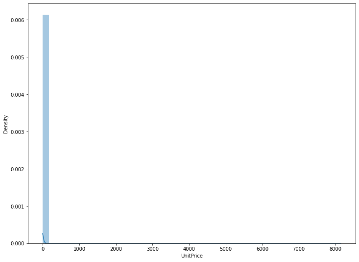

A similar trend as the distribution plot of the Quantity can be seen in the Distribution plot of the UnitPrice as well. This behavior can be explained with the help of all the zeroes present in the corresponding columns. Considering this fact in mind while preprocessing the data we will ignore the rows containing the zeros.

From the countplot which is shown below we can see that most of the data points are from the United States. The contribution from all other countries combined is not close to the same from the United States.

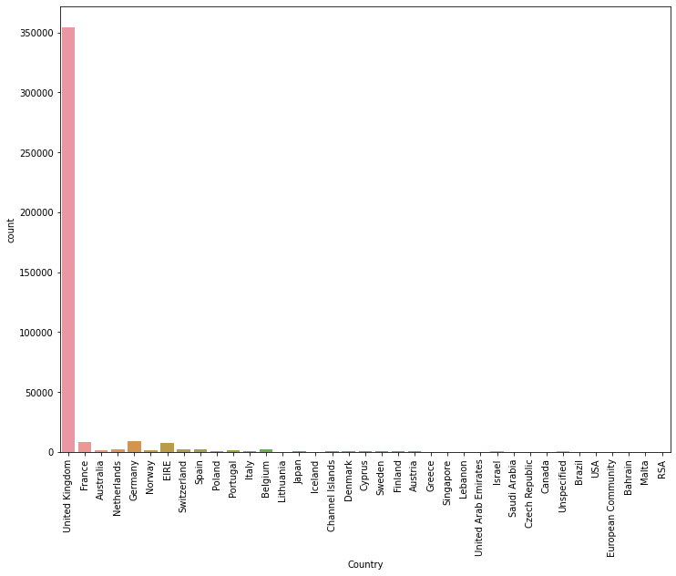

<h2 class="c28">Statistical exploration</h2>
The statistical analysis shows us the standard deviation, minimum value and maximum value and other statistical values. 

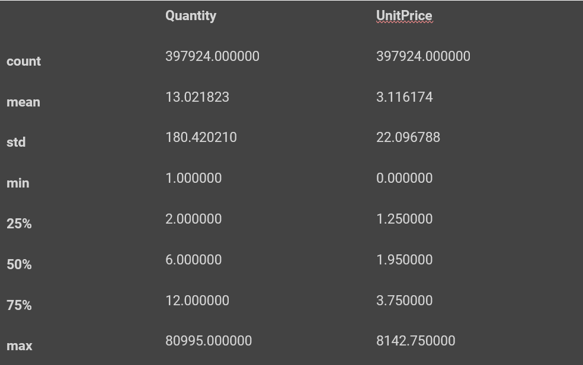
<h2 class="c28">Correlation analysis</h2>

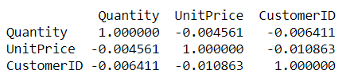

Humans are not very good with dealing numerical data in terms of analysis, so looking at a matrix will not help. That&rsquo;s where the heatmap helps. Following heatmap shows the correlation of the Quantity, Unit Price and Customer ID with (shows correlation with each column) Quantity, Unit Price and CustomerID. 

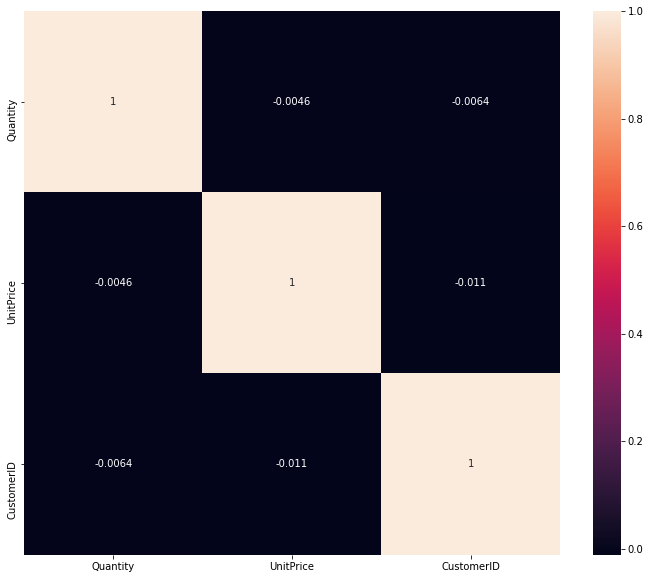

From the heatmap shown above we can see that even the Quantity and UnitPrice columns don&#39;t seem to be quite correlated (small correlation). Since the correlation values are very close to zero.

Small correlation = value should be close to zero ignoring negative positive (one increase one doesn&rsquo;t increase)

Positive value = means directly portion to the other (both increase) 

Close to zero no correlation.

<h2 class="c28">Suitable transformation of variables</h2>
The model that we will be using later for the K-means clustering is based on similarity and dissimilarity of any two data points which is calculated using the Euclidean distance between the points. That&rsquo;s why we need to standardize the data before clustering, after the standardization the data looks.

<table class="c55"><tbody><tr class="c25"><td class="c75" colspan="1" rowspan="1">

</td><td class="c31" colspan="1" rowspan="1">
monetary
</td><td class="c29" colspan="1" rowspan="1">
frequency
</td><td class="c33" colspan="1" rowspan="1">
recency
</td></tr><tr class="c25"><td class="c19" colspan="1" rowspan="1">
0
</td><td class="c31" colspan="1" rowspan="1">
2.329673
</td><td class="c29" colspan="1" rowspan="1">
-0.396968
</td><td class="c33" colspan="1" rowspan="1">
-0.322010
</td></tr><tr class="c25"><td class="c19" colspan="1" rowspan="1">
1
</td><td class="c31" colspan="1" rowspan="1">
-0.900449
</td><td class="c29" colspan="1" rowspan="1">
0.405730
</td><td class="c33" colspan="1" rowspan="1">
0.226551
</td></tr><tr class="c25"><td class="c19" colspan="1" rowspan="1">
2
</td><td class="c31" colspan="1" rowspan="1">
-0.170421
</td><td class="c29" colspan="1" rowspan="1">
-0.263924
</td><td class="c33" colspan="1" rowspan="1">
-0.119035
</td></tr><tr class="c25"><td class="c19" colspan="1" rowspan="1">
3
</td><td class="c31" colspan="1" rowspan="1">
-0.740443
</td><td class="c29" colspan="1" rowspan="1">
-0.077663
</td><td class="c33" colspan="1" rowspan="1">
0.368086
</td></tr><tr class="c25"><td class="c19" colspan="1" rowspan="1">
4
</td><td class="c31" colspan="1" rowspan="1">
2.179667
</td><td class="c29" colspan="1" rowspan="1">
-0.326011
</td><td class="c33" colspan="1" rowspan="1">
-0.248598
</td></tr></tbody></table>

<h2 class="c28">Elimination of redundant variables</h2>
The data contains a lot of redundant values, there are multiple duplicates of the same data point. The redundancy is supposed to be removed. The following tables show the data information before removing the redundant row and the data information after removing the redundant rows.

Data before redundancy removal:

Data columns (total 8 columns):

&nbsp;# &nbsp; Column &nbsp; &nbsp; &nbsp; Non-Null Count &nbsp; Dtype &nbsp; &nbsp; &nbsp; &nbsp; 

--- &nbsp;------ &nbsp; &nbsp; &nbsp; -------------- &nbsp; ----- &nbsp; &nbsp; &nbsp; &nbsp; 

&nbsp;0 &nbsp; InvoiceNo &nbsp; &nbsp;397924 non-null &nbsp;object &nbsp; &nbsp; &nbsp; &nbsp;

&nbsp;1 &nbsp; StockCode &nbsp; &nbsp;397924 non-null &nbsp;object &nbsp; &nbsp; &nbsp; &nbsp;

&nbsp;2 &nbsp; Description &nbsp;397924 non-null &nbsp;object &nbsp; &nbsp; &nbsp; &nbsp;

&nbsp;3 &nbsp; Quantity &nbsp; &nbsp; 397924 non-null &nbsp;int64 &nbsp; &nbsp; &nbsp; &nbsp; 

&nbsp;4 &nbsp; InvoiceDate &nbsp;397924 non-null &nbsp;datetime64[ns]

&nbsp;5 &nbsp; UnitPrice &nbsp; &nbsp;397924 non-null &nbsp;float64 &nbsp; &nbsp; &nbsp; 

&nbsp;6 &nbsp; CustomerID &nbsp; 397924 non-null &nbsp;float64 &nbsp; &nbsp; &nbsp; 

&nbsp;7 &nbsp; Country &nbsp; &nbsp; &nbsp;397924 non-null &nbsp;object &nbsp;&nbsp; &nbsp; &nbsp; 

Data after redundancy removal:

Data columns (total 8 columns):

&nbsp;# &nbsp; Column &nbsp; &nbsp; &nbsp; Non-Null Count &nbsp; Dtype &nbsp; &nbsp; &nbsp; &nbsp; 

--- &nbsp;------ &nbsp; &nbsp; &nbsp; -------------- &nbsp; ----- &nbsp; &nbsp; &nbsp; &nbsp; 

&nbsp;0 &nbsp; InvoiceNo &nbsp; &nbsp;392732 non-null &nbsp;object &nbsp; &nbsp; &nbsp; &nbsp;

&nbsp;1 &nbsp; StockCode &nbsp; &nbsp;392732 non-null &nbsp;object &nbsp; &nbsp; &nbsp; &nbsp;

&nbsp;2 &nbsp; Description &nbsp;392732 non-null &nbsp;object &nbsp; &nbsp; &nbsp; &nbsp;

&nbsp;3 &nbsp; Quantity &nbsp; &nbsp; 392732 non-null &nbsp;int64 &nbsp; &nbsp; &nbsp; &nbsp; 

&nbsp;4 &nbsp; InvoiceDate &nbsp;392732 non-null &nbsp;datetime64[ns]

&nbsp;5 &nbsp; UnitPrice &nbsp; &nbsp;392732 non-null &nbsp;float64 &nbsp; &nbsp; &nbsp; 

&nbsp;6 &nbsp; CustomerID &nbsp; 392732 non-null &nbsp;float64 &nbsp; &nbsp; &nbsp; 

&nbsp;7 &nbsp; Country &nbsp; &nbsp; &nbsp;392732 non-null &nbsp;object &nbsp; &nbsp; &nbsp; &nbsp;

From the above description we can clearly notice that the data contained around 5000 redundant rows.
<h2 class="c28">Data visualization</h2>

The following graph shows count-plot for Country, distribution plot for Quantity and unit price. Then the heat map. &nbsp;These graphs show the pattern and redundancy presented in the data which we removed after the analysis of respective graphs. &nbsp;
<table class="c55"><tbody><tr class="c60"><td class="c26" colspan="1" rowspan="1">
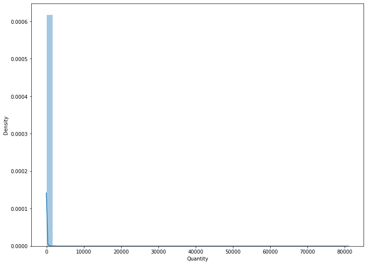
</td><td class="c26" colspan="1" rowspan="1">
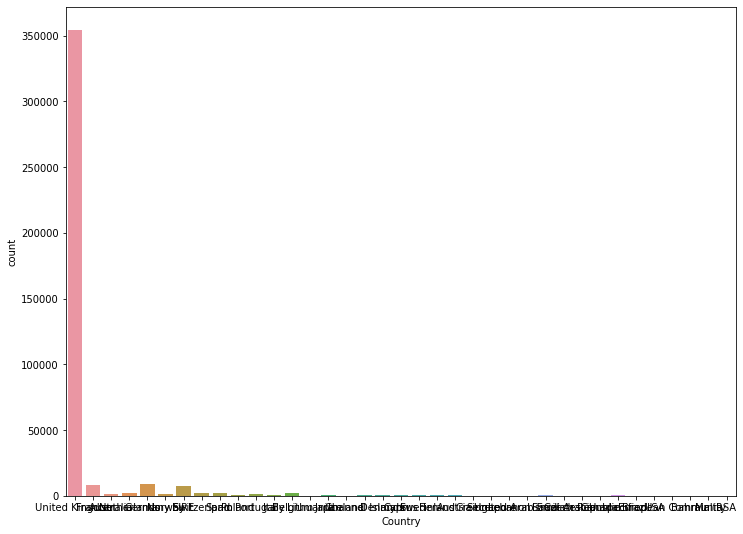
</td></tr><tr class="c60"><td class="c26" colspan="1" rowspan="1">

</td><td class="c26" colspan="1" rowspan="1">

</td></tr></tbody></table><h2 class="c28">Management of missing values</h2>

While gathering the data in the real world, a lot of the data contained a lot of missing values. In our data there are some missing values mainly in two columns Description and CustomerID. Since customerID is a very important feature, we will drop all the rows in which either customerID or Description columns contain null values. The following list contains the column names and corresponding number of null values.

InvoiceNo &nbsp; &nbsp; &nbsp; &nbsp; &nbsp; 0

StockCode &nbsp; &nbsp; &nbsp; &nbsp; &nbsp; 0

Description &nbsp; &nbsp; &nbsp;1454

Quantity &nbsp; &nbsp; &nbsp; &nbsp; &nbsp; &nbsp;0

InvoiceDate &nbsp; &nbsp; &nbsp; &nbsp; 0

UnitPrice &nbsp; &nbsp; &nbsp; &nbsp; &nbsp; 0

CustomerID &nbsp; &nbsp; 135080

Country &nbsp; &nbsp; &nbsp; &nbsp; &nbsp; &nbsp; 0

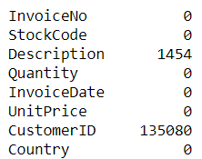

Now the following list shows the same information but after removing the null values.

InvoiceNo &nbsp; &nbsp; &nbsp;0

StockCode &nbsp; &nbsp; &nbsp;0

Description &nbsp; &nbsp;0

Quantity &nbsp; &nbsp; &nbsp; 0

InvoiceDate &nbsp; &nbsp;0

UnitPrice &nbsp; &nbsp; &nbsp;0

CustomerID &nbsp; &nbsp; 0

Country &nbsp; &nbsp; &nbsp; &nbsp;0

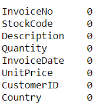

Apart from the missing values we have some columns which contain zeroes as well so we will remove all the rows which contain zeros in those columns. And we will only be using CustomerID, InvoiceDate, InvoiceNo, Quantity and UnitPrice columns.

So now since the data has been cleaned, we are good to proceed with the further models. 

Below is the dataframe showing the processed data.

<table class="c55"><tbody><tr class="c25"><td class="c57" colspan="1" rowspan="1">

</td><td class="c42" colspan="1" rowspan="1">
CustomerID
</td><td class="c8" colspan="1" rowspan="1">
InvoiceDate
</td><td class="c48" colspan="1" rowspan="1">
InvoiceNo
</td><td class="c39" colspan="1" rowspan="1">
Quantity
</td><td class="c48" colspan="1" rowspan="1">
UnitPrice
</td></tr><tr class="c25"><td class="c18" colspan="1" rowspan="1">
0
</td><td class="c42" colspan="1" rowspan="1">
17850.0
</td><td class="c8" colspan="1" rowspan="1">
2010-12-01 08:26:00
</td><td class="c48" colspan="1" rowspan="1">
536365
</td><td class="c39" colspan="1" rowspan="1">
6
</td><td class="c48" colspan="1" rowspan="1">
2.55
</td></tr><tr class="c25"><td class="c18" colspan="1" rowspan="1">
1
</td><td class="c42" colspan="1" rowspan="1">
17850.0
</td><td class="c8" colspan="1" rowspan="1">
2010-12-01 08:26:00
</td><td class="c48" colspan="1" rowspan="1">
536365
</td><td class="c39" colspan="1" rowspan="1">
6
</td><td class="c48" colspan="1" rowspan="1">
3.39
</td></tr><tr class="c25"><td class="c18" colspan="1" rowspan="1">
2
</td><td class="c42" colspan="1" rowspan="1">
17850.0
</td><td class="c8" colspan="1" rowspan="1">
2010-12-01 08:26:00
</td><td class="c48" colspan="1" rowspan="1">
536365
</td><td class="c39" colspan="1" rowspan="1">
8
</td><td class="c48" colspan="1" rowspan="1">
2.75
</td></tr><tr class="c25"><td class="c18" colspan="1" rowspan="1">
3
</td><td class="c42" colspan="1" rowspan="1">
17850.0
</td><td class="c8" colspan="1" rowspan="1">
2010-12-01 08:26:00
</td><td class="c48" colspan="1" rowspan="1">
536365
</td><td class="c39" colspan="1" rowspan="1">
6
</td><td class="c48" colspan="1" rowspan="1">
3.39
</td></tr><tr class="c25"><td class="c18" colspan="1" rowspan="1">
4
</td><td class="c42" colspan="1" rowspan="1">
17850.0
</td><td class="c8" colspan="1" rowspan="1">
2010-12-01 08:26:00
</td><td class="c48" colspan="1" rowspan="1">
536365
</td><td class="c39" colspan="1" rowspan="1">
6
</td><td class="c48" colspan="1" rowspan="1">
3.39
</td></tr></tbody></table>

<h1 class="c16">Perform RFM Segmentation</h1><h2 class="c28">Definition of RFM metrics</h2>
RFM is a combined abbreviation of three different words Recency Frequency and Monetary value. Recency represents how recently the customer did a purchase, Frequency shows how often the customer does purchase and Monetary value shows how much a customer spends for the purchase.

Recency can be calculated by finding out the number of months or the number of days since the last time the customer made the purchase. To calculate the Frequency, we look at how many times the customer did purchases in the last unit of time, this unit can be years or months. &nbsp;To calculate the Monetary value either we can calculate the total amount spent by a customer from his first purchase to his last purchase or we can include the highest value spent by the customer.

RFM segmentation is a very often term used for various businesses because it is used to calculate the value of a particular customer, using this RFM value a business can make strategies about offers, advertisement and coupon codes.
<h2 class="c28">Implementation in Python/R correct metrics</h2>
To implement RFM Segmentation in our use case we will need to apply some aggregation on invoice date invoice number and unit price column. For the invoice date column, we will calculate the number of days past since the customer made his or her last purchase, for invoice number we will find out the total number of purchases done by the customer and for the unit price column we will do a summation of the total amount spent by a customer. 

The following table shows the data created by applying the above-mentioned aggregate methods.

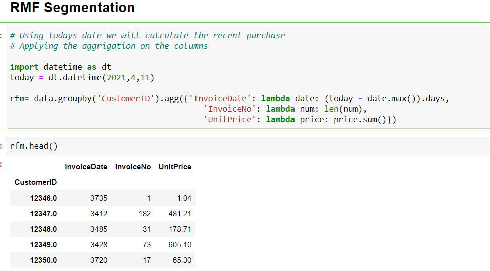

The next step is to discretize the monetary frequency and recency columns. We will categorize each and every value of respective columns into four different types 1,2,3,4. Pandas contains a predefined function for this quantization named pd.qcut(). 

The result obtained after quantization is shown in the following table, we can clearly see that apart from the monetary, frequency and recency column we have three more columns named recency_quantile frequency_quantile and monetary_quantile. 

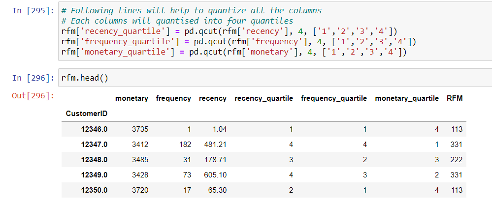

After having the quantized version of all the three columns now we can create The RFM value for each and every customer by combining the quantized value of three different columns next to each other for example for a customer having recently_quantile equal to 1 frequency_quantile equal to 1 and monetary_quantile equal to 3 The RFM value will be 113. 

Following figure shows the segmentation matrix.

To generate the square plot we will categorise the customers according to the RFM values and then we will perform a count of customers of each category. Now using these count values and the Category names we will generate the graph.

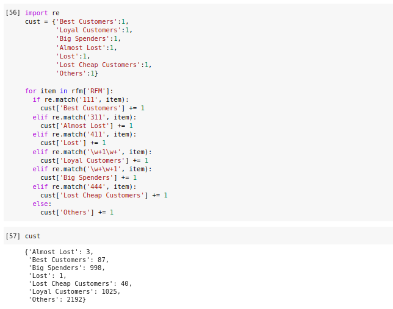

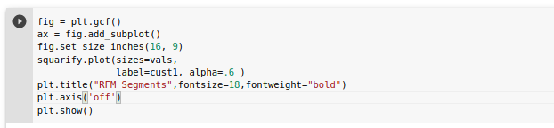

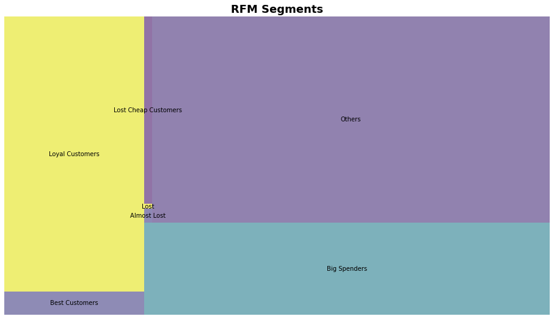

<h1 class="c16" id="h.gjdgxs">Customer Segmentation with K-Means</h1><h2 class="c28">Build of K-Means Model in Python</h2>

For K-means clustering we will be using Same data which is used for RFM Segmentation but since K-mean clustering involves similarity measurement between the data points using Euclidean distance we will need to normalise the data before performing the k-mean clustering. if we do not perform the normalisation a column which contains comparatively large values may affect the final result of the clustering. After the application of standardization the final data set which was generated is shown below.

<table class="c55"><tbody><tr class="c25"><td class="c70" colspan="1" rowspan="1">

</td><td class="c52" colspan="1" rowspan="1">
monetary
</td><td class="c29" colspan="1" rowspan="1">
frequency
</td><td class="c33" colspan="1" rowspan="1">
recency
</td></tr><tr class="c25"><td class="c43" colspan="1" rowspan="1">
0
</td><td class="c52" colspan="1" rowspan="1">
2.329673
</td><td class="c29" colspan="1" rowspan="1">
-0.396968
</td><td class="c33" colspan="1" rowspan="1">
-0.322010
</td></tr><tr class="c25"><td class="c43" colspan="1" rowspan="1">
1
</td><td class="c52" colspan="1" rowspan="1">
-0.900449
</td><td class="c29" colspan="1" rowspan="1">
0.405730
</td><td class="c33" colspan="1" rowspan="1">
0.226551
</td></tr><tr class="c25"><td class="c43" colspan="1" rowspan="1">
2
</td><td class="c52" colspan="1" rowspan="1">
-0.170421
</td><td class="c29" colspan="1" rowspan="1">
-0.263924
</td><td class="c33" colspan="1" rowspan="1">
-0.119035
</td></tr><tr class="c25"><td class="c43" colspan="1" rowspan="1">
3
</td><td class="c52" colspan="1" rowspan="1">
-0.740443
</td><td class="c29" colspan="1" rowspan="1">
-0.077663
</td><td class="c33" colspan="1" rowspan="1">
0.368086
</td></tr><tr class="c25"><td class="c43" colspan="1" rowspan="1">
4
</td><td class="c52" colspan="1" rowspan="1">
2.179667
</td><td class="c29" colspan="1" rowspan="1">
-0.326011
</td><td class="c33" colspan="1" rowspan="1">
-0.248598
</td></tr></tbody></table>

<h2 class="c28">Correct Justification of K value</h2>

Since the data is prepared the next step is to create an instance of the K-means clustering model. For the model definition we will need the correct value of k, &nbsp;to obtain a precise value for K we will use the elbow method. For reference we will use the inertia value of the models made using the value of k ranging from 2 to 20.

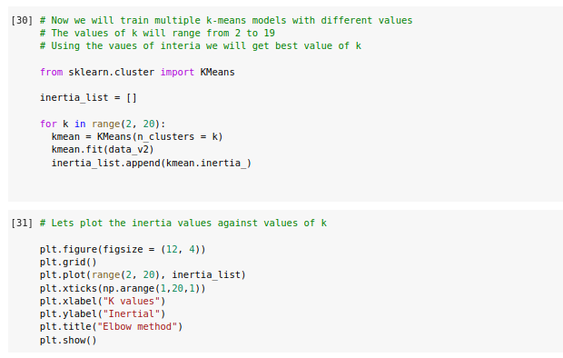

&nbsp;The following graph shows the variation of inertia with respect to the K values. 

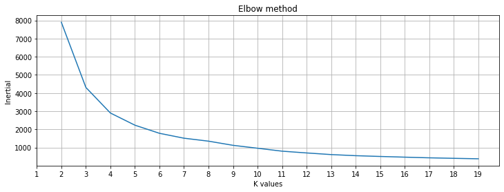

From the graph we can clearly see the elbow point at K = 4 because the variation of inertia after K = 4 is very smooth.
<h2 class="c28">Testing of K-Means Model in Python</h2>

Now since we have managed to get the correct value for K we can now proceed to create the final k-means model. After training and the prediction of the model we have assigned numbers as labels to each 4 clusters from 0 to 3. The following 3D graph shows all the clusters in different colours.

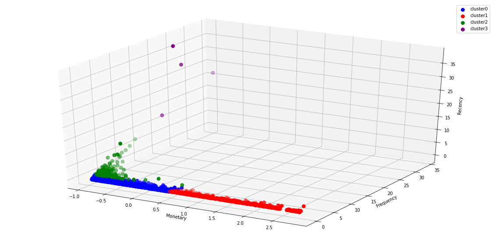

<h1 class="c16">Review of Results</h1><h2 class="c28">Identification of business value customer segments</h2>

Considering the table made by Joao Correia to relate the RFM values with the type of the customers we can analyse each and every customer and create different segments where we can put different type of customers like;
<ul class="c38 lst-kix_list_2-0 start"><li class="c4 li-bullet-0">&#39;Best Customers&#39;,</li><li class="c4 li-bullet-0">&#39;Loyal Customers&#39;,</li><li class="c4 li-bullet-0">&#39;Big Spenders&#39;,</li><li class="c4 li-bullet-0">&#39;Almost Lost&#39;,</li><li class="c4 li-bullet-0">&#39;Lost&#39;,</li><li class="c4 li-bullet-0">&#39;Lost Cheap Customers&#39;</li></ul>

<table class="c79"><tbody><tr class="c82"><td class="c68" colspan="1" rowspan="1">
Segment
</td><td class="c76" colspan="1" rowspan="1">
RFM
</td><td class="c67" colspan="1" rowspan="1">
Description
</td><td class="c56" colspan="1" rowspan="1">
Count
</td></tr><tr class="c50"><td class="c36" colspan="1" rowspan="1">
Best Customers
</td><td class="c40" colspan="1" rowspan="1">
111
</td><td class="c11" colspan="1" rowspan="1">
Customers who bought most recently, most often and spend the most.
</td><td class="c47" colspan="1" rowspan="1">
87
</td></tr><tr class="c23"><td class="c36" colspan="1" rowspan="1">
Loyal Customers
</td><td class="c40" colspan="1" rowspan="1">
X1X
</td><td class="c11" colspan="1" rowspan="1">
Customers who bought most recently
</td><td class="c47" colspan="1" rowspan="1">
1025
</td></tr><tr class="c74"><td class="c36" colspan="1" rowspan="1">
Big Spenders
</td><td class="c40" colspan="1" rowspan="1">
XX1
</td><td class="c11" colspan="1" rowspan="1">
Customers who spend the most
</td><td class="c47" colspan="1" rowspan="1">
998
</td></tr><tr class="c59"><td class="c36" colspan="1" rowspan="1">
Almost Lost
</td><td class="c40" colspan="1" rowspan="1">
311
</td><td class="c11" colspan="1" rowspan="1">
Haven&#39;t purchased for some time, but purchased frequently and spent the most.
</td><td class="c47" colspan="1" rowspan="1">
3
</td></tr><tr class="c63"><td class="c36" colspan="1" rowspan="1">
Lost Customers
</td><td class="c40" colspan="1" rowspan="1">
411
</td><td class="c11" colspan="1" rowspan="1">
Haven&#39;t purchased for a very long long time, but purchased frequently and spent the most.
</td><td class="c47" colspan="1" rowspan="1">
1
</td></tr><tr class="c62"><td class="c36" colspan="1" rowspan="1">
Lost Cheap Customers
</td><td class="c40" colspan="1" rowspan="1">
444
</td><td class="c11" colspan="1" rowspan="1">
Last purchase was a long time ago, I purchased a few and spent little.
</td><td class="c47" colspan="1" rowspan="1">
40
</td></tr><tr class="c62"><td class="c36" colspan="1" rowspan="1">
Others
</td><td class="c40" colspan="1" rowspan="1">
---
</td><td class="c11" colspan="1" rowspan="1">
Customers who don&#39;t fit in any of the above categories
</td><td class="c47" colspan="1" rowspan="1">
2192
</td></tr></tbody></table>

The K-means algorithm creates 4 different segments, each containing some amount of customers. The count of each segment is shown below.

1 &nbsp; &nbsp;3052

0 &nbsp; &nbsp;1060

3 &nbsp; &nbsp; 223

2 &nbsp; &nbsp; &nbsp; 4

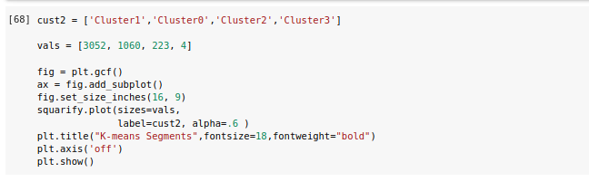

If we create a square plot of the segments created by K-means it will look like follows;

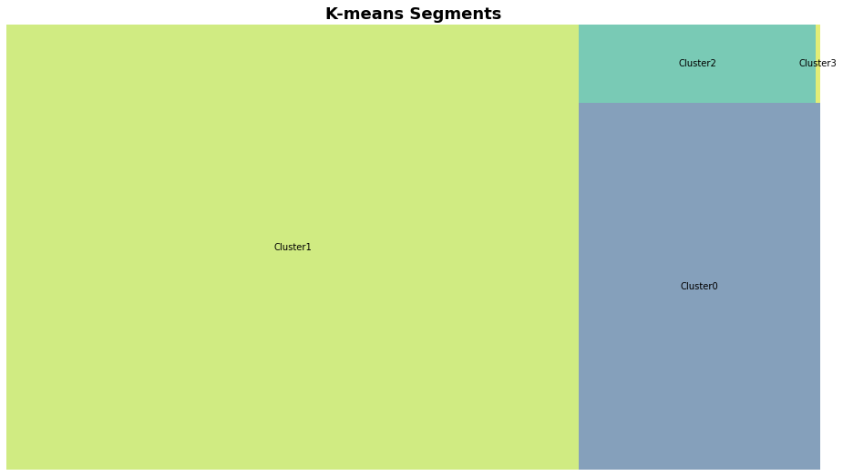

From the analysis shown before it can be concluded that the main factors in deciding customers for in other words the main factors for segmenting different types of customers are the frequency of purchase and the amount spent on the purchase. &nbsp;Considering the mentioned factors as the most important factors we can identify the following dimensions for data mart design.
<ol class="c38 lst-kix_list_3-0 start" start="1"><li class="c4 li-bullet-0">Time of Purchase</li><li class="c4 li-bullet-0">Payment Mode</li><li class="c4 li-bullet-0">Payment Amount</li><li class="c4 li-bullet-0">Number of total purchases</li><li class="c4 li-bullet-0">Current purchase Date</li><li class="c4 li-bullet-0">Last Purchase Date</li></ol>
We can clearly see that the frequency is one of the most important features in the segmentation of the customers in our project. &nbsp; We clearly know that the frequency of purchase for any customer &nbsp;is derived from the number of Total purchases made and is dependent on the timing of purchase. As a result we are considering the two dimensions as &ldquo;time of purchase&rdquo;&nbsp;and &ldquo;number of Total purchases&rdquo;&nbsp;is relevant. Now the next important &nbsp;feature appears to be monetary since monetary is highly related to the payment mode since nowadays the transactions of large amounts are most commonly made through either online transaction or &nbsp;card based payments, &nbsp;apart from the more of the transaction the amount which was paid is also important, That is why we&#39;re considering&nbsp;&ldquo;payment mode&quot; and &quot;payment amount&quot;.&nbsp;The recency of the purchase does not hold a lot of importance but still because it is relevant to any purchase made by any customer and it is directly connected to the &ldquo;last purchase date&rdquo;&nbsp;and the &ldquo;current purchase date&rdquo;&nbsp;and the time of purchase. 

</body></html>
